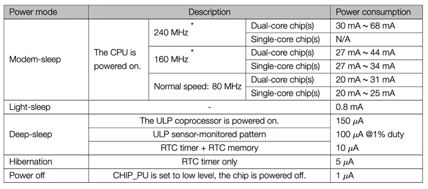

# MediBox

A embebedd project which mainly focused for the Medibox where tempurature and humidity control is essential.

## Optimizations

- Interrupt driven architecture
    - Instead of using pooling method,in here interrupt routes are used for display update,set alarms
- Power Management
    - Once data is updated in the display device will be going to sleep mode which pauses the CPU operation and enter to **light_sleep** mode
        - Normal Power Consumption per second - 3.3*20 = 66 mJ
        - Sleep based Power Consumption per second - 3.3*(20\*0.2 + 0.8\*0.8) = 15.31 mJ
        - Power Saving - 76.8 %

## Screenshots

